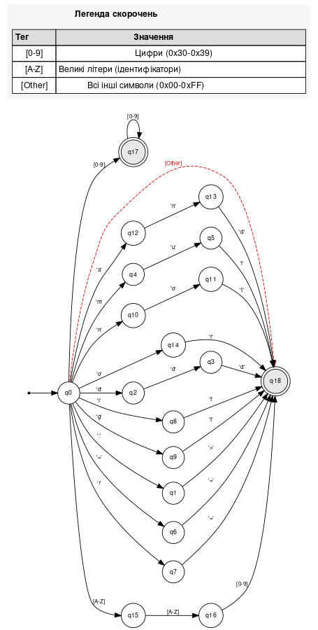
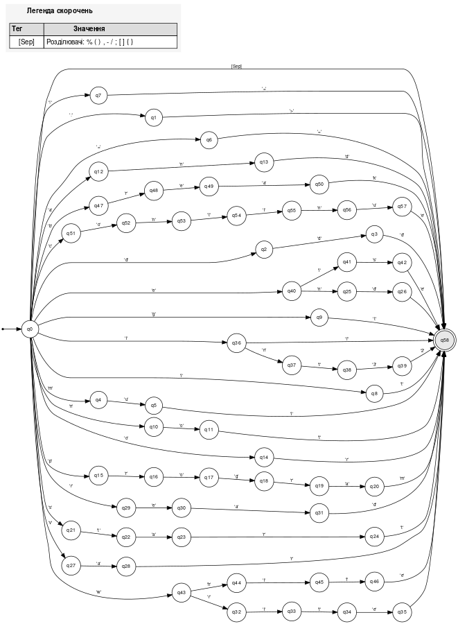
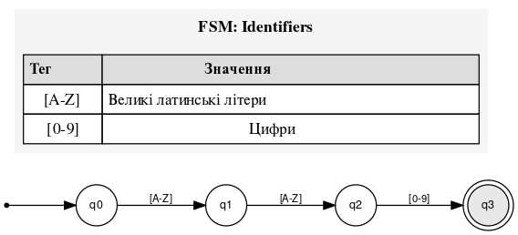
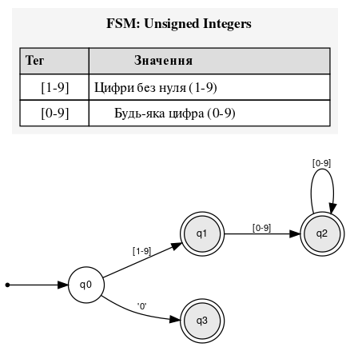
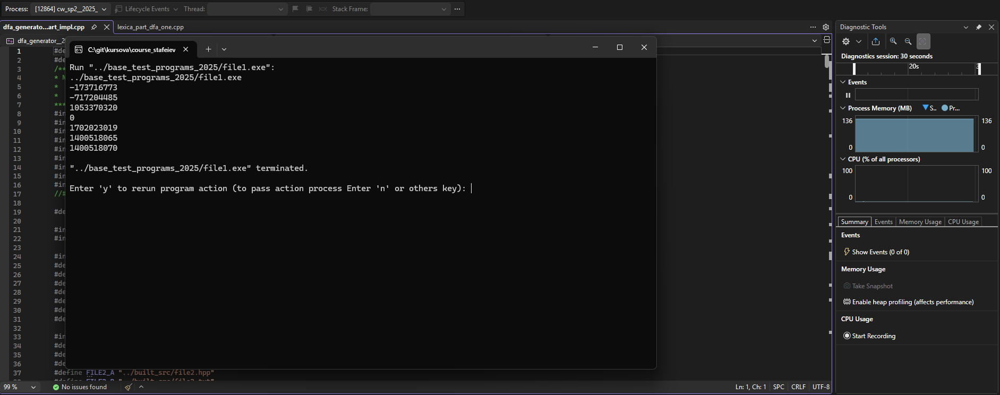
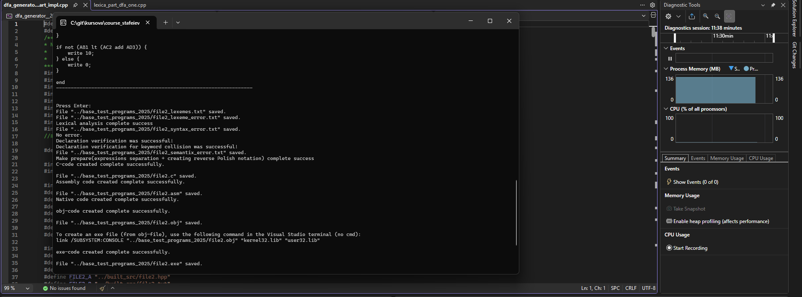
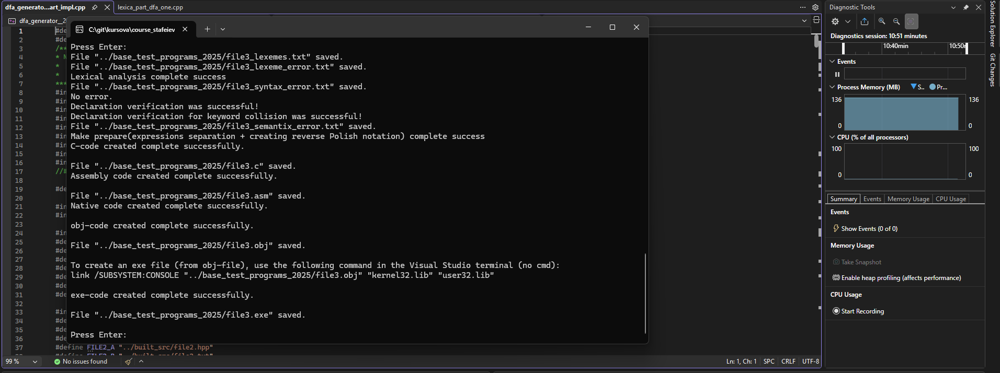

# Звіт з курсового проєкту

## ТИТУЛЬНА СТОРІНКА

## ЗАВДАННЯ НА КУРСОВЕ ПРОЄКТУВАННЯ

### а) Скріншот варіанту завдання

1. Цільова мова транслятора – мова програмування С або асемблер для 32/64 розрядного процесора.
2. Для отримання виконуваного файлу на виході розробленого транслятора скористатися середовищем Microsoft Visual Studio або будь-яким іншим
3. Мова розробки транслятора: C/C++
4. Реалізувати графічну оболонку або інтерфейс з командного рядка.
5. На вхід розробленого транслятора має подаватися текстовий файл, написаний на заданій мові програмування.
6. На виході розробленого транслятора мають створюватись такі файли:
файл з лексемами;
файл з повідомленнями про помилки (або про їх відсутність);
файл на мові С або асемблера;
об’єктний файл;
виконуваний файл
7. Назва вхідної мови програмування утворюється від першої букви у прізвищі студента та останніх двох цифр номера його варіанту. Саме таке розширення повинні мати текстові файли, написані на цій мові програмування

### Деталізація завдання та проектування


*Рис. 1.1. Скріншот варіанту завдання*

**Таблиця 1.1.** Синтаксичні елементи мови

| Елемент | Ключове слово |
|---------|---------------|
| Блок тіла програми | `program <name>; start var...; end` |
| Оператори вводу-виводу | `read`, `write` |
| Оператор присвоєння | `<rvalue> :> <lvalue>` (присвоєння зліва направо) |
| Керуючі конструкції | `if` [else] (як у мові Rust)<br>`while` (як у мові Rust)<br>Оператор індексації: `[]` (як у мові C)<br>Порожній оператор: `;` (як у мові C)<br>Початковий символ блоку: `{` (як у мові C)<br>Кінцевий символ блоку: `}` (як у мові C) |
| Регістр ключових слів | Нижній регістр (lowercase) |
| Формат ідентифікаторів (регулярний вираз) | `[A-Z][A-Z][0-9]` |
| Операції | **Арифметичні:** `add`, `-`, `mul`, `/`, `%`<br>**Порівняння:** `==`, `!=`, `lt`, `gt`<br>**Логічні:** `not`, `and`, `or` |
| Тип даних | `int32` з підтримкою індексації масивів `[]` |
| Коментар | `/*...` |

**Примітка:** Додатково реалізувати оператори переривання та продовження циклу (`break`, `continue`).

## АНОТАЦІЯ

Курсовий проєкт присвячений розробці транслятора для спеціалізованої мови програмування, яка є мінімалістичною імперативною мовою з типізованими змінними, призначеною для навчальних цілей та демонстрації основних концепцій проектування компіляторів. Метою проєкту є створення повнофункціонального транслятора, який перетворює програми на мові S25 у виконуваний код на мові С або асемблері для 32/64-розрядних процесорів.

Основні етапи розробки включають лексичний аналіз для розпізнавання токенів на основі регулярних виразів та побудови детермінованого скінченного автомата, синтаксичний аналіз з використанням LL(2)-парсера з двосимвольним випередженням та граматикою у форматі EBNF з побудовою автомата з магазинною пам'яттю, семантичний аналіз для перевірки коректності використання змінних включаючи оголошення ініціалізацію та області видимості з виявленням конфліктів імен, а також генерацію коду через створення абстрактного синтаксичного дерева та перетворення його у цільовий код на мові С з подальшою компіляцією у виконуваний файл.

Технологічний стек проєкту базується на мові розробки C++ з використанням інструментів Boost.Spirit для верифікації граматики, PlantUML для візуалізації алгоритмів та Microsoft Visual Studio як середовища розробки, а також формальних моделей включаючи регулярні вирази, EBNF-граматику, детерміновані скінченні автомати та автомати з магазинною пам'яттю. Результатами роботи є транслятор з інтерфейсом командного рядка, що генерує файли токенів, повідомлення про помилки, абстрактне синтаксичне дерево, код на мові С, об'єктний та виконуваний файли, а також повна технічна документація з формальним описом мови, блок-схемами алгоритмів та прикладами тестових програм. Практична цінність проєкту полягає у демонстрації повного циклу розробки транслятора від формального опису мови до генерації виконуваного коду, що забезпечує глибоке розуміння внутрішньої будови компіляторів та принципів їх функціонування.

## ЗМІСТ

1. [Огляд методів та способів проєктування трансляторів](#1-огляд-методів-та-способів-проєктування-трансляторів)
2. [Формальний опис вхідної мови програмування](#2-формальний-опис-вхідної-мови-програмування)
   - 2.1. [Деталізований опис вхідної мови в термінах розширеної нотації Бекуса-Наура](#21-деталізований-опис-вхідної-мови-в-термінах-розширеної-нотації-бекуса-наура)
   - 2.2. [Опис термінальних символів та ключових слів](#22-опис-термінальних-символів-та-ключових-слів)
3. [Розробка транслятора з вхідної мови програмування](#3-розробка-транслятора-з-вхідної-мови-програмування)
   - 3.1. [Вибір технології програмування](#31-вибір-технології-програмування)
   - 3.2. [Проектування таблиць транслятора та вибір структур даних](#32-проектування-таблиць-транслятора-та-вибір-структур-даних)
   - 3.3. [Розробка лексичного аналізатора](#33-розробка-лексичного-аналізатора)
   - 3.4. [Розробка синтаксичного та семантичного аналізатора](#34-розробка-синтаксичного-та-семантичного-аналізатора)
   - 3.5. [Розробка генератора коду](#35-розробка-генератора-коду)
4. [Налагодження та тестування розробленого транслятора](#4-налагодження-та-тестування-розробленого-транслятора)
   - 4.1. [Опис інтерфейсу та інструкції користувачу](#41-опис-інтерфейсу-та-інструкції-користувачу)
   - 4.2. [Виявлення лексичних і синтаксичних помилок](#42-виявлення-лексичних-і-синтаксичних-помилок)
   - 4.3. [Перевірка роботи транслятора за допомогою тестових задач](#43-перевірка-роботи-транслятора-за-допомогою-тестових-задач)
5. [Висновки](#висновки)
6. [Список літературних джерел](#список-літературних-джерел)
7. [Додатки](#додатки)

## ВСТУП

Розробка трансляторів та компіляторів є фундаментальним розділом інформатики та програмної інженерії, оскільки компілятор представляє собою складну програмну систему, яка перетворює вихідний код високорівневої мови програмування у машинний код або проміжне представлення. Розуміння принципів роботи компіляторів необхідне для оптимізації продуктивності програмного забезпечення, створення нових мов програмування та предметно-орієнтованих мов, розробки інструментів аналізу коду таких як лінтери форматери та рефакторингові засоби, а також для глибокого розуміння виконання програм на різних рівнях абстракції. Навчальні проєкти з розробки трансляторів дозволяють студентам практично застосувати теоретичні знання з формальних мов автоматів алгоритмів та структур даних у реальних задачах проектування програмного забезпечення.

Метою курсового проєкту є проектування та реалізація повнофункціонального транслятора для спеціалізованої мови програмування S25, який здійснює перетворення вихідного коду у виконуваний файл з детальною діагностикою помилок на всіх етапах компіляції. Для досягнення поставленої мети необхідно вирішити низку завдань, що включають формалізацію вхідної мови через розробку формального опису у термінах EBNF-граматики визначення лексичної структури за допомогою регулярних виразів для токенів та специфікацію синтаксичних і семантичних правил, реалізацію лексичного аналізу через побудову детермінованого скінченного автомата для розпізнавання токенів та забезпечення обробки коментарів і пробільних символів, створення синтаксичного аналізатора на основі автомата з магазинною пам'яттю для LL(2)-граматики з двосимвольним випередженням та побудовою абстрактного синтаксичного дерева, розробку семантичного аналізатора для перевірки оголошень змінних контролю їх ініціалізації перед використанням та виявлення конфліктів імен і помилок області видимості, імплементацію генератора коду для перетворення абстрактного синтаксичного дерева у код на мові С з коректною обробкою виразів операторів і керуючих конструкцій та інтеграцією з компілятором С для отримання виконуваного файлу, а також проведення тестування через розробку набору тестових програм створення детальної технічної документації та демонстрацію працездатності розробленого транслятора.

Звіт з курсового проєкту структуровано у вигляді послідовних розділів що висвітлюють всі аспекти розробки транслятора. Перший розділ присвячений огляду методів та способів проєктування трансляторів з аналізом етапів компіляції типів парсерів та формальних моделей. Другий розділ містить формальний опис вхідної мови програмування включаючи EBNF-граматику лексичну структуру та синтаксичні правила. Третій розділ детально описує проектування основних компонент транслятора а саме лексичного синтаксичного та семантичного аналізаторів і генератора коду. Четвертий розділ представляє результати тестування та експериментальних досліджень з набором тестових програм аналізом помилок та демонстрацією роботи системи. Завершується звіт висновками що узагальнюють підсумки виконаної роботи досягнуті результати та можливі напрямки подальшого розвитку, а також додатками що містять лістинги коду блок-схеми таблиці переходів автоматів та приклади згенерованого коду.

## 1. ОГЛЯД МЕТОДІВ ТА СПОСОБІВ ПРОЄКТУВАННЯ ТРАНСЛЯТОРІВ

На перший погляд, різноманітність компіляторів вражає. Використовуються тисячі вихідних мов, від традиційних, таких як Fortran і Pascal, до спеціалізованих, які виникають у всіх областях застосування комп’ютера. Цільові мови не менш різноманітні –це можуть бути інші мови програмування, різні машинні мови –від мов мікропроцесорівдо суперкомп’ютерів. Компілятори класифікують як однопрохідні, багато прохідні, виконуючі (load-and-go), відлагоджуючі, оптимізуючи –в залежності від призначення і принципів і технологій їх створення. Не дивлячись на те, що основні задачі, що виконуютьсякомпіляторами видаються складними і різноманітними, по суті вони одні і ті ж. Розуміючи ці задачі, ми можемо створювати компілятори для різних вихідних мов і цільових машин з використанням одних і тих же базових технологій. Компіляція складається з двох частин: аналізу і синтезу. 
Аналіз –це розбиття початкової програми на складові частини і створення її проміжного представлення.

Синтез –конструювання необхідної цільової програми з проміжного представлення. В процесі аналізу визначаються і записуються в ієрархічну деревовидну структуру операції, задані початковою програмою. Часто використовується спеціальний вид дерева, що називається синтаксичним (або деревом синтаксичного розбору), в якому кожен вузол представляє операцію, а його дочірні вузли –аргументи операції. Багато програмних інструментів, працюючи з початковими програмами, спочатку виконують певний вид аналізу. Розглянемо приклади таких інструментів. Структурні редактори. Ці програми одержують як вхід послідовність команд для побудови початкової програми. Такий редактор не тільки виконує звичні для текстового редактора функції зі створення і модифікації тексту, але і аналізує текст програми, поміщаючи в початкову програму відповідну ієрархічну структуру. Тим самим він виконує додаткові задачі, що полегшують підготовку програми. Наприклад, редактор може перевіряти коректність введеного тексту, автоматично додавати структурні елементиабо переходить від ключового слова begin або лівої дужки до відповідного end або правої дужки. Початкова програма може бути розділена на модулі, що зберігаються в окремих файлах. Задача збору початкової програми іноді доручається окремій програмі –препроцесору, який може також розкривати в тексті початкової програми скорочення, так звані макроси. Цільова програма, створювана компілятором, може зажадати додаткову обробку перед запуском. Компілятор, створює асемблерний код, який переводиться асемблером в машинний код, а потім зв'язується («лінкуєтся») спільно з деякими бібліотечними програмами в код, що реально запускається на машин.

## 2. ФОРМАЛЬНИЙ ОПИС ВХІДНОЇ МОВИ ПРОГРАМУВАННЯ

### 2.1. Деталізований опис вхідної мови в термінах розширеної нотації Бекуса-Наура

Граматика мови програмування формалізована у розширеній нотації Бекуса-Наура (Extended Backus-Naur Form, EBNF), яка дозволяє компактно та однозначно описати синтаксичну структуру мови. EBNF використовує метасимволи для опису повторень, опціональних елементів та альтернатив, що робить граматику більш читабельною порівняно з класичною BNF.

Основні метасимволи EBNF:
- `::=` — визначення правила (нетермінал визначається через термінали та інші нетермінали)
- `|` — альтернатива (вибір одного з варіантів)
- `()` — групування елементів
- `[]` — опціональний елемент (може бути присутнім або відсутнім)
- `{}` — повторення нуль або більше разів
- `"..."` — термінальний символ (ключове слово або оператор)
- `<...>` — нетермінальний символ (правило граматики)

Граматика складається з 52 правил, опис наведено у таблиці (Таблиця 2.1):

> [EBNFVerify.md](EBNFVerify.md)

### 2.2. Опис термінальних символів та ключових слів

Для опису граматики мови слід задати термінальні символи цієї мови.

Термінал або термінальний символ - об'єкт, безпосередньо присутній в словах мови, відноситься до граматики, і має конкретне, незмінне значення. До термінальних символів віднесемо також усі цифри (0-9), латинські букви (a-z, A-Z), символи табуляції,символ переходу на нову стрічку, пробілу, знаку “-“.

Ключові слова — це слова, які не можуть використовуватися як ідентифікатор, наприклад, назва змінної, функції або мітки — воно «зарезервоване від використання». Це визначене синтаксисом слово і воно може зовсім не мати значення.

Нижче наведено список термінальних символів та слів, що використовуються для опису граматики моєї мови:


| Термінальний символ або ключове слово | Значення |
|----------------------------------------|----------|
|  program    |     Початок   програми (ім’я програми)    |
|  start    |     Початок   виконуваного коду    |
|  end    |     Кінець програми    |
|  var    |     Блок оголошення   змінних    |
|  int32    |     Тип даних    |
|  read    |     Вивід даних    |
|  write    |     Ввід даних    |
|  if    |     Початок   умовного оператора    |
|  else    |     Альтернативна   гілка умовного оператора    |
|  while    |     Цикл з   передумовою    |
|  break    |     Вихід з циклу    |
|  continue    |     Перехід до   наступної ітерації циклу    |
|  :>    |     Оператор   присвоєння    |
|  add    |     Оператор   додавання    |
|  -    |     Оператор   віднімання    |
|  mul    |     Оператор   множення    |
|  /    |     Оператор   ділення без остачі    |
|  %    |     Оператор   ділення по модулю    |
|  ==    |     Оператор   порівняння (дорівнює)    |
|  !=    |     Оператор   нерівності (не дорівнює)    |

## 3. РОЗРОБКА ТРАНСЛЯТОРА З ВХІДНОЇ МОВИ ПРОГРАМУВАННЯ

### 3.1. Вибір технології програмування

Перед початком розробки програмного забезпечення транслятора необхідно було визначити технологію програмування, мову програмування та середовище розробки, які б забезпечили ефективну реалізацію всіх етапів компіляції. Також важливим етапом було проектування алгоритмів функціонування основних компонентів системи.

Для виконання поставленого завдання найбільш доцільним виявилося використання мови програмування C++, яка забезпечує високу продуктивність, підтримку різноманітних структур даних та можливість низькорівневих операцій, необхідних для ефективної роботи з пам'яттю при обробці великих обсягів вихідного коду. Середовищем розробки було обрано Microsoft Visual Studio 2019, що надає потужні засоби для компіляції, налагодження, профілювання коду та зручного управління багатомодульним проєктом.

Для забезпечення зручності використання розробленого транслятора кінцевим користувачем було прийнято рішення про створення консольного інтерфейсу з підтримкою параметрів командного рядка. Такий підхід дозволяє легко інтегрувати транслятор у процес автоматизованої збірки та використовувати його в скриптах. Консольний інтерфейс реалізований у модулі `cli.h` та підтримує різні режими роботи: лексичний аналіз, синтаксичний аналіз, семантичну перевірку, генерацію коду та повну компіляцію з подальшим запуском.

Архітектура транслятора побудована на принципах модульності, що дозволяє розділити функціональність на окремі логічні компоненти: лексичний аналізатор (`lexica_part_dfa_one.cpp`), синтаксичний аналізатор (`syntax.cpp`), семантичний аналізатор (`semantics.cpp`), препроцесор (`preparer.cpp`) та генератор коду (`generator.cpp`). Використання стандартних бібліотек C++ (STL) та додаткових інструментів, таких як бібліотека Boost.Spirit для верифікації граматики, дозволило спростити код, підвищити його читабельність та забезпечити надійність роботи системи.

### 3.2. Проектування таблиць транслятора та вибір структур даних

Для оптимізації процесу розробки та забезпечення ефективності роботи транслятора було спроектовано систему структур даних, яка включає таблиці лексем, ідентифікаторів, а також спеціалізовані структури для зберігання інформації про токени, вузли синтаксичного дерева та семантичні атрибути. Використання структурованих типів даних дозволяє наочно відобразити архітектуру програми та полегшує сприйняття її логічної структури.

**Основні структури даних:**

**Структура для зберігання інформації про лексему:**

```cpp
struct LexemInfo {
    char lexemStr[MAX_LEXEM_SIZE];        // Рядкове представлення лексеми
    unsigned long long int lexemId;        // Унікальний ідентифікатор
    unsigned long long int tokenType;      // Тип токену
    unsigned long long int ifvalue;        // Числове значення (для літералів)
    unsigned long long int row;            // Номер рядка у вихідному коді
    unsigned long long int col;            // Номер стовпця у вихідному коді
};
```

Ця структура забезпечує повне представлення кожної лексеми, включаючи її позицію у вихідному файлік.

**Типи лексем:**

```cpp
#define KEYWORD_LEXEME_TYPE 1          // Ключові слова (program, start, if, while)
#define IDENTIFIER_LEXEME_TYPE 2        // Ідентифікатори змінних
#define VALUE_LEXEME_TYPE 4             // Числові літерали
#define UNEXPEXTED_LEXEME_TYPE 127      // Невідомі або помилкові лексеми
```

**Структура вузла абстрактного синтаксичного дерева (AST):**

```cpp
struct ASTNode {
    char name[MAX_NAME_SIZE];           // Назва правила граматики
    int lexemIndex;                     // Індекс лексеми у таблиці
    ASTNode* parent;                    // Батьківський вузол
    ASTNode* children[MAX_CHILDREN];    // Масив дочірніх вузлів
    int childCount;                     // Кількість дочірніх вузлів
};
```

Дерево AST будується під час синтаксичного аналізу та використовується для семантичної перевірки і генерації коду.

**Таблиці транслятора:**

```cpp
struct LexemInfo lexemesInfoTable[MAX_WORD_COUNT];           // Таблиця лексем
char identifierIdsTable[MAX_WORD_COUNT][MAX_LEXEM_SIZE];     // Таблиця ідентифікаторів
int transitionTable[SYMBOL_NUMBER][MAX_STATES];              // Таблиця переходів DFA
```

* Таблиця лексем зберігає послідовність розпізнаних токенів з їх атрибутами.
* Таблиця ідентифікаторів містить унікальні імена змінних, що використовуються у програмі.
* Таблиця переходів детермінованого скінченного автомата визначає поведінку лексичного аналізатора при розпізнаванні токенів.

Усі лексеми після аналізу формуються у структуровану таблицю, яка може бути збережена у файл для подальшого аналізу або відображена в консолі для налагодження.

### 3.3. Розробка лексичного аналізатора

Лексичний аналізатор є першим етапом обробки вхідного тексту програми. Його завданням є розбиття потоку символів на послідовність токенів (лексем) згідно з визначеннями мови програмування.

#### Регулярні вирази для лексичного аналізу

Лексичний аналізатор використовує систему регулярних виразів для розпізнавання токенів вхідної мови. Для зручності опису та підтримки коду регулярні вирази організовані у вигляді макросів (макровизначень), які потім комбінуються для формування загального виразу токенізатора.

**Регулярний вираз для токенізатора:**

```plain
;|:>|add|-|mul|/|%|==|!=|lt|gt|not|and|or|[|]|(|)|{|}|,|[_A-Za-z0-9]+|[^ \t\r\f\v\n]
```

Цей вираз охоплює всі можливі токени мови: оператори, ключові слова, ідентифікатори та числові літерали.

**Регулярний вираз для ключових слів:**

```plain
;|:>|add|-|mul|/|%|==|!=|lt|gt|not|and|or|[|]|(|)|{|}|,|program|start|end|var|read|write|if|else|while|break|continue|int32
```

**Регулярний вираз для ідентифікаторів:**

```plain
[A-Z][A-Z][0-9]
```

Ідентифікатори складаються рівно з двох великих латинських літер та однієї цифри.

**Регулярний вираз для цілих літералів:**

```plain
0|[1-9][0-9]*
```

Цей вираз забороняє ведучі нулі (leading zeros), дозволяючи або саме число `0`, або числа, що починаються з ненульової цифри.

**Обробка коментарів:**

Коментарі у мові S25 починаються з `/*` і мають бути видалені на етапі препроцесингу перед лексичним аналізом. Лексичний аналізатор не розпізнає коментарі як окремі токени, що спрощує граматику та уникає неоднозначностей у синтаксичному аналізі.

**Тестування лексичного аналізатора:**

Код на основі регулярних виразів коректно опрацьовує тестові програми:


#### 3.3.1. Розробка блок-схеми алгоритму

Блок-схема алгоритму лексичного аналізатора представлена на рисунку нижче:


> <puml/lexical_analyzer_flowchart.puml>

#### 3.3.2. Опис програми реалізації лексичного аналізатора

Реалізація лексичного аналізатора складається з двох основних компонентів: власне аналізатора (файл `lexica_part_dfa__2025/lexica_part_dfa_one.cpp`) та генератора детермінованих скінченних автоматів (файли `dfa_generator__2025/dfa_generator___part_impl.cpp` та `built_src/matcher_by_dfa.hpp`).

##### Процес перетворення регулярних виразів у недетерміновані скінченні автомати (NFA)

Побудова NFA з регулярного виразу базується на конструктивному алгоритмі Томпсона, який рекурсивно перетворює регулярні вирази в еквівалентні автомати. Алгоритм використовує базові операції над автоматами:

**Базові випадки:**

Для елементарних регулярних виразів будуються прості автомати:
- Для символу `a` створюється автомат з двох станів, з'єднаних дугою з міткою `a`
- Для порожнього слова `ε` створюється автомат з переходом по ε-дузі
- Для порожньої множини `∅` створюється автомат без переходів

**Операція об'єднання (альтернація) `e + f`:**

Для регулярних виразів `e` та `f` з відповідними автоматами M₁ та M₂:
- Вводиться новий початковий стан `s₀`
- Вводиться новий заключний стан `t`
- З `s₀` проводяться ε-переходи до початкових станів обох автоматів M₁ та M₂
- З усіх заключних станів M₁ та M₂ проводяться ε-переходи до нового заключного стану `t`

```cpp
// З файлу dfa_generator___part_impl.cpp
void process_alternation(const char* re, int* pos, int* state, int start, int end) {
    // Створення нового початкового стану для альтернації
    int alt_start = (*state)++;
    
    // Обробка першої альтернативи
    process_term(re, pos, state, alt_start, end);
    
    while (re[*pos] == '|') {
        (*pos)++; // Пропустити '|'
        // Обробка наступної альтернативи
        process_term(re, pos, state, alt_start, end);
    }
}
```

**3. Операція конкатенації `e · f`:**

Скінченний автомат для конкатенації будується шляхом послідовного з'єднання автоматів M₁ та M₂:

- Зберігаються всі дуги і вершини автоматів M₁ та M₂
- Початковий стан M₁ стає початковим станом результату
- Множина заключних станів M₂ стає множиною заключних станів результату
- Кожен заключний стан M₁ з'єднується ε-дугою з початковим станом M₂

**4. Операція ітерації (замикання Кліні) `e*`:**

Для автомата M будується новий автомат:

- Вводиться новий початковий стан `s₀`
- Вводиться новий заключний стан `t`
- Проводиться порожня дуга з `s₀` до `t` (для прийняття порожнього слова)
- Проводяться порожні дуги з `s₀` до колишнього початкового стану M
- Проводяться порожні дуги з усіх колишніх заключних станів M назад до початкового стану M
- Проводяться порожні дуги з усіх колишніх заключних станів M до нового заключного стану `t`

**Реалізація в коді:**

```cpp
struct Transition {
    int from;      // Стан, з якого йде перехід
    int to;        // Стан, в який йде перехід
    int symbolCode; // Код символу (EPSILON = -1 для ε-переходів)
};

Transition transitions[1024];
int transition_count = 0;

// Додавання переходу до автомата
void add_transition(int from, int to, int symbol) {
    transitions[transition_count].from = from;
    transitions[transition_count].to = to;
    transitions[transition_count].symbolCode = symbol;
    transition_count++;
}
```

Таким чином, побудова NFA відбувається композиційно, шляхом послідовного застосування базових конструкцій для кожної операції регулярного виразу.

##### Детальний опис процесу видалення λ-переходів для отриманих NFA

Видалення ε-переходів (λ-переходів) є важливим етапом перетворення NFA в еквівалентний автомат без порожніх переходів. Алгоритм базується на побудові ε-замикання (λ-closure) для кожного стану.

**Поняття ε-замикання:**

ε-замикання стану `q` (позначається `ε-closure(q)` або `λ-closure(q)`) — це множина всіх станів, досяжних з `q` шляхом переходів тільки по ε-дугах (включаючи сам стан `q`).

**Алгоритм видалення ε-переходів:**

1. Побудова множини переходів автомата M' без ε-переходів:

Для довільних двох станів `p, r ∈ Q` існує перехід з `p` в `r` по дузі з міткою `a` в автоматі M', якщо виконується одна з умов:

a) У вихідному автоматі M існує безпосередній перехід `p →ᵃ r`

б) Існує такий стан `q` та послідовність переходів, що:
   - `p ⇒ᵉ q` (з `p` в `q` можна потрапити по ε-переходах)
   - `q →ᵃ r` (з `q` в `r` існує перехід по символу `a`)

в) Існують стани `q` та `t`, що:
   - `p ⇒ᵉ q` (з `p` в `q` можна потрапити по ε-переходах)
   - `q →ᵃ t` (з `q` в `t` існує перехід по символу `a`)
   - `t ⇒ᵉ r` (з `t` в `r` можна потрапити по ε-переходах)

**Табличний метод:**

Для кожного стану `q` та символу `a`:

```
δ'(q, a) = ε-closure(δ(ε-closure(q), a))
```

Де:

- `δ(q, a)` — множина станів автомата M, до яких можна потрапити з `q` по дузі з міткою `a`
- `δ(ε-closure(q), a)` — множина станів, до яких можна потрапити з множини станів ε-замикання `q` по дузі з міткою `a`
- `ε-closure(δ(ε-closure(q), a))` — множина станів автомата M', до яких ведуть дуги з міткою `a` зі стану `q`

2. Визначення заключних станів F':

Множина заключних станів F' автомата M' містить всі стани `q ∈ Q'`, які:

- Або належали до заключних станів початкового автомата M (тобто `q ∈ F`)
- Або з яких веде шлях ненульової довжини з `q` в заключний стан `f ∈ F` початкового автомата M з міткою шляху `ε`:

```
F' = {q ∈ Q' | q ∈ F або ∃f ∈ F: q ⇒ᵉ f}
```

3. Видалення недосяжних станів:

Всі стани, крім початкового, в які заходять тільки дуги з міткою ε, видаляються. Це визначає множину Q' скінченного автомата M'. Зрозуміло, що Q' ⊆ Q. При цьому початковий стан залишається попереднім.

**Реалізація в коді:**

```cpp
// Обчислення ε-замикання для множини станів
void compute_epsilon_closure(int state, int* closure, int* closure_size) {
    closure[(*closure_size)++] = state;
    
    for (int i = 0; i < transition_count; i++) {
        if (transitions[i].from == state && transitions[i].symbolCode == EPSILON) {
            int to_state = transitions[i].to;
            
            // Перевірка, чи стан вже в замиканні
            int already_in = 0;
            for (int j = 0; j < *closure_size; j++) {
                if (closure[j] == to_state) {
                    already_in = 1;
                    break;
                }
            }
            
            if (!already_in) {
                compute_epsilon_closure(to_state, closure, closure_size);
            }
        }
    }
}
```

##### Детальний опис процесу перетворення NFA (після видалення λ-переходів) у детермінований скінченний автомат (DFA)

Перетворення NFA в DFA виконується за алгоритмом побудови підмножин (subset construction, алгоритм Томпсона-Макнафтона-Ямамото). Основна ідея полягає в тому, що кожен стан DFA відповідає підмножині станів NFA.

**Принцип детермінізації:**

Скінченний автомат M = (Q, Σ, δ, I, F) називається детермінованим, якщо:

1. Множина I містить рівно один елемент (один початковий стан)
2. Для кожного переходу (p, x, q) ∈ δ виконується рівність |x| = 1 (мітки переходів є однобуквеними)
3. Автомат не містить дуг з порожніми ε-мітками
4. Для кожного символу a ∈ Σ і для довільного стану p ∈ Q існує тільки один стан q ∈ Q такий, що (p, a, q) ∈ δ

**Алгоритм детермінізації:**

**1. Ініціалізація:**

- Початковий стан DFA відповідає множині початкових станів NFA: `{q₀}`
- Створюється черга неопрацьованих станів DFA

**2. Побудова станів DFA:**

  Для кожного неопрацьованого стану DFA (який є підмножиною станів NFA):
    - Для кожного символу `a` алфавіту:
    - Обчислюється множина станів NFA, досяжних з поточної підмножини по символу `a`
    - Ця множина стає новим станом DFA (якщо його ще немає)
    - Додається перехід в таблицю переходів DFA

**3. Визначення заключних станів:**

Стан DFA є заключним, якщо відповідна йому підмножина станів NFA містить хоча б один заключний стан NFA.

**Реалізація в коді:**

```cpp
void generate_transition_table(int start_state, int* finit_states, int finit_states_count,
                               int table[SYMBOL_NUMBER][MAX_STATES], int* state_count) {
    // Ініціалізація таблиці переходів
    for (int symbol = 0; symbol < SYMBOL_NUMBER; symbol++) {
        for (int state = 0; state < MAX_STATES; state++) {
            table[symbol][state] = ND; // ND = недетермінований (відсутній перехід)
        }
    }
    
    // Черга для обробки станів (побудова підмножин)
    int queue[MAX_STATES][MAX_STATES]; // queue[i] - підмножина станів NFA
    int queue_sizes[MAX_STATES];
    int queue_start = 0, queue_end = 0;
    
    // Початковий стан DFA
    queue[queue_end][0] = start_state;
    queue_sizes[queue_end] = 1;
    queue_end++;
    (*state_count) = 1;
    
    // Побудова підмножин
    while (queue_start < queue_end) {
        int current_subset_size = queue_sizes[queue_start];
        int* current_subset = queue[queue_start];
        int current_dfa_state = queue_start;
        
        // Для кожного символу алфавіту
        for (int symbol = 0; symbol < SYMBOL_NUMBER; symbol++) {
            int new_subset[MAX_STATES];
            int new_subset_size = 0;
            
            // Обчислення переходів для всіх станів у підмножині
            for (int i = 0; i < current_subset_size; i++) {
                int nfa_state = current_subset[i];
                
                // Знаходження всіх переходів по символу symbol
                for (int j = 0; j < transition_count; j++) {
                    if (transitions[j].from == nfa_state && 
                        transitions[j].symbolCode == symbol) {
                        int to_state = transitions[j].to;
                        
                        // Додавання стану до нової підмножини (якщо його там немає)
                        int already_in = 0;
                        for (int k = 0; k < new_subset_size; k++) {
                            if (new_subset[k] == to_state) {
                                already_in = 1;
                                break;
                            }
                        }
                        if (!already_in) {
                            new_subset[new_subset_size++] = to_state;
                        }
                    }
                }
            }
            
            if (new_subset_size > 0) {
                // Перевірка, чи вже існує такий стан DFA
                int existing_state = -1;
                for (int i = 0; i < queue_end; i++) {
                    if (queue_sizes[i] == new_subset_size) {
                        int match = 1;
                        for (int j = 0; j < new_subset_size; j++) {
                            int found = 0;
                            for (int k = 0; k < new_subset_size; k++) {
                                if (queue[i][k] == new_subset[j]) {
                                    found = 1;
                                    break;
                                }
                            }
                            if (!found) {
                                match = 0;
                                break;
                            }
                        }
                        if (match) {
                            existing_state = i;
                            break;
                        }
                    }
                }
                
                if (existing_state == -1) {
                    // Новий стан DFA
                    for (int i = 0; i < new_subset_size; i++) {
                        queue[queue_end][i] = new_subset[i];
                    }
                    queue_sizes[queue_end] = new_subset_size;
                    table[symbol][current_dfa_state] = queue_end;
                    queue_end++;
                    (*state_count)++;
                } else {
                    // Перехід до існуючого стану
                    table[symbol][current_dfa_state] = existing_state;
                }
            }
        }
        
        queue_start++;
    }
}
```

##### Детальний опис процесу мінімізації (ключовий етап) DFA

Мінімізація скінченного автомата полягає в побудові еквівалентного автомата з мінімальною кількістю станів. Алгоритм базується на концепції k-еквівалентності станів.

**Відношення k-еквівалентності:**

На множині станів автомата M = (Q, Σ, δ, I, F) визначається сімейство відношень еквівалентності:

**1) 0-еквівалентність (=⁰):**

Два стани q₁, q₂ є 0-еквівалентними (q₁ =⁰ q₂), якщо обидва стани одночасно належать F або Q\F, тобто обидва стани одночасно є заключними або одночасно незаключними.

**2) k-еквівалентність (=ᵏ) при k > 0:**

Стани q₁, q₂ є k-еквівалентними (q₁ =ᵏ q₂) тоді і тільки тоді, коли:
q₁ =ᵏ⁻¹ q₂ (стани є (k-1)-еквівалентними)
Для кожного символу a ∈ Σ стани δ(q₁, a) та δ(q₂, a) також є (k-1)-еквівалентними

**Графічна інтерпретація:**

```
      q₁ ○─────a────→ ○ δ(q₁, a)
                        ∈ C    (клас (k-1)-еквівалентності)
      
      q₂ ○─────a────→ ○ δ(q₂, a)
```

Якщо q₁ та q₂ є (k-1)-еквівалентними і для будь-якого вхідного символу a стани δ(q₁, a) та δ(q₂, a) також є (k-1)-еквівалентними, то q₁ та q₂ стануть k-еквівалентними. Можна сказати, що перехід по будь-якому вхідному символу "зберігає" (k-1)-еквівалентність станів.

**Алгоритм мінімізації:**

Мінімізація полягає в послідовному подрібненні множини станів Q автомата M на класи еквівалентності доти, поки не отримаємо розбиття, яке вже не можна подрібнити. Відношення будуються до такого найменшого k, що відношення =ᵏ⁺¹ збігається з відношенням =ᵏ. Це відношення визначає найдрібніше розбиття множини станів.

**Побудова мінімального автомата M' = (Q', Σ, δ', I', F'):**

1. **Множина станів Q':** До множини станів Q' вводять тільки по одному стану з кожного класу еквівалентності. Узагальнений стан для класу n позначається через [qₙ].

2. **Початковий стан I':** Вхідним станом стає узагальнений стан [q₀], який позначає клас, куди входять початкові стани автомата M: I' = {[q₀]}.

3. **Множина переходів δ':** δ' = {([qₙ], a, [δ([qₙ], a)])}, тобто в множину переходів включається перехід з узагальненого стану [qₙ] за символом a в узагальнений стан, до якого належать стани, що є результатом переходу за символом a зі станів, що входять у клас [qₙ].

4. **Заключні стани F':** Узагальнений стан є заключним, якщо хоча б один стан з його класу еквівалентності є заключним у вихідному автоматі.

**Реалізація видалення недосяжних станів:**

```cpp
#ifdef USE_DFA_MINIMIZATION
void removing_unreachable_DFA_states(int* dead_state, int* nextFreeState) {
    int state_counter = *nextFreeState;
    int old2NewStates[MAX_STATES] = { 0 }; // завжди 0 -> 0 (початковий стан)
    int old2NewStateCount = 1;

    // Пошук досяжних станів
    for (int state = 1; state < state_counter; ++state) {
        int old2NewStateIndex = old2NewStateCount - 1;
        
        // Перевірка, чи стан вже відмічений як досяжний
        while (--old2NewStateIndex >= 0) 
            if (old2NewStates[old2NewStateIndex] == state) break;
        
        // Перевірка всіх переходів
        for (int transitionIndex = 0; transitionIndex < transition_count; ++transitionIndex) {
            if (transitions[transitionIndex].to == state) {
                // Стан досяжний
                if (old2NewStateIndex == -1) {
                    old2NewStateIndex = old2NewStateCount++;
                }
                old2NewStates[old2NewStateIndex] = state;
            }
        }
    }
    
    // Перенумерація станів
    // Видалення недосяжних станів з таблиці переходів
    for (int symbol = 0; symbol < SYMBOL_NUMBER; symbol++) {
        for (int state = 0; state < state_counter; state++) {
            int new_state = -1;
            
            // Знаходження нового номера стану
            for (int i = 0; i < old2NewStateCount; i++) {
                if (old2NewStates[i] == state) {
                    new_state = i;
                    break;
                }
            }
            
            if (new_state != -1) {
                // Перенумерація переходу
                int target = transitionTable[symbol][state];
                if (target != ND) {
                    for (int i = 0; i < old2NewStateCount; i++) {
                        if (old2NewStates[i] == target) {
                            transitionTable[symbol][new_state] = i;
                            break;
                        }
                    }
                }
            }
        }
    }
    
    *nextFreeState = old2NewStateCount;
    *dead_state = old2NewStateCount; // Мертвий стан
}
#endif
```

**Результат мінімізації:**

Після застосування алгоритму мінімізації отримуємо детермінований скінченний автомат з мінімальною кількістю станів, еквівалентний вихідному автомату. Це зменшує розмір таблиці переходів та підвищує ефективність лексичного аналізатора.

##### Детерміновані скінченні автомати

**1. Повністю детермінований скінченний автомат для токенізації:**

а) **Двовимірний масив для програмного моделювання** [](../built_src/file1.hpp):

```cpp
int transitionTable1[SYMBOL_NUMBER][MAX_STATES] = {
//          Q000   Q001   Q002   Q003   Q004   ...
/*  '\x00' */ { Q000, Q000, Q000, Q000, Q000, ... },
/*  '\x01' */ { Q018, Q000, Q000, Q000, Q000, ... },
// ... решта символів
};

int transitionTable1FinitStates[MAX_FINIT_STATES] = { Q017, Q018 };
```

б) **Орієнтований граф**



Діаграма відображає узагальнений скінченний автомат для розпізнавання основних категорій токенів вхідної мови. Автомат починається з початкового стану `q0` та містить два фінальні стани (`q17`, `q18`), позначені подвійними колами. Червона пунктирна лінія від `q0` до `q18` позначена як `[Other]` забезпечує обробку всіх інших символів (помилкових або роздільників).

**2. Повністю детермінований скінченний автомат для розпізнавання підмови ключових слів:**

а) **Двовимірний масив** [](../built_src/file2.hpp):

```cpp
int transitionTable2[SYMBOL_NUMBER][MAX_STATES] = {
//          Q000   Q001   Q002   Q003   ...
/*  '\x00' */ { Q058, Q058, Q058, Q058, ... },
/*  ';'    */ { Q057, Q058, Q058, Q058, ... },
/*  'a'    */ { Q001, Q058, Q058, Q058, ... },
// ... решта символів
};

int transitionTable2FinitStates[MAX_FINIT_STATES] = { Q057, Q058 };
```

б) **Орієнтований граф**



Діаграма представляє деталізований скінченний автомат, спеціалізований на розпізнаванні всіх ключових слів та операторів мови програмування. Автомат має один фінальний стан `q58`. Автомат реалізує детермінований підхід - кожен символ однозначно визначає наступний стан. Відбувається розгалуження для слів, що починаються з однієї літери (наприклад, 'e' → 'else' або 'end'; 'w' → 'while' або 'write').

**3. Повністю детермінований скінченний автомат для розпізнавання підмови ідентифікаторів:**

а) **Двовимірний масив** [](../built_src/file3.hpp):

```cpp
int transitionTable3[SYMBOL_NUMBER][MAX_STATES] = {
//          Q000   Q001   Q002   Q003   Q004
/*  '\x00' */ { Q004, Q004, Q004, Q004, Q004 },
/*  '0'    */ { Q004, Q004, Q003, Q004, Q004 },
/*  '1'    */ { Q004, Q004, Q003, Q004, Q004 },
// ... цифри 2-9
/*  'A'    */ { Q001, Q002, Q004, Q004, Q004 },
// ... літери B-Z
};

int transitionTable3FinitStates[MAX_FINIT_STATES] = { Q003 };
```

б) **Орієнтований граф**



Діаграма ілюструє скінченний автомат для розпізнавання ідентифікаторів. Згідно з варіантом завдання, ідентифікатори мають специфічний формат: 2 великих латинських літери та цифра.

**4. Повністю детермінований скінченний автомат для розпізнавання підмови беззнакових літералів із фіксованою комою:**

а) **Двовимірний масив** [](../built_src/file4.hpp):

```cpp
int transitionTable4[SYMBOL_NUMBER][MAX_STATES] = {
//          Q000   Q001   Q002   Q003
/*  '\x00' */ { Q003, Q003, Q003, Q003 },
/*  '0'    */ { Q001, Q003, Q002, Q003 },
/*  '1'    */ { Q002, Q003, Q002, Q003 },
// ... цифри 2-9
};

int transitionTable4FinitStates[MAX_FINIT_STATES] = { Q001, Q002 };
```

б) **Орієнтований граф**



Діаграма демонструє скінченний автомат для розпізнавання беззнакових цілих чисел. Автомат реалізує правило, яке забороняє ведучі нулі (leading zeros) у числах, крім самого числа 0. Стан Q001 — для числа `0`, стан Q002 — для чисел від `1` до `999...`. Обидва стани є фінальними, але перехід з Q001 можливий тільки в "мертвий" стан Q003.

### 3.4. Розробка синтаксичного та семантичного аналізатора

Синтаксичний аналізатор виконує перевірку структури програми на відповідність формальній граматиці мови програмування.

Синтаксичний аналізатор працює з таблицею лексем та граматикою, яка містить 52 правила виведення. Кожне правило має умови для двох токенів випередження, що забезпечує детермінований вибір без backtracking.

#### 3.4.1. Розробка дерев граматичного розбору

**Синтез граматики відповідно до EBNF**

Граматика мови програмування формалізована у розширеній нотації Бекуса-Наура (EBNF) та представлена уфайлах (EBNF_N1.h, EBNF_N2.h)

**Специфікація lookahead у правилах виведення**

Для моделі LL(2)-аналізатора використовується попереднє читання двох токенів (lookahead 2). Це необхідно для розрізнення альтернативних правил виведення без backtracking. Наприклад:

- Розпізнавання виразу з можливим присвоєнням: `expression assign_to_right__optional`
- Розрізнення операторів: `statement` може бути виразом, циклом, введенням, виведенням або порожнім оператором
- Опціональні конструкції: `declaration__optional`, `body_for_false__optional`

**Модель LL(2)-аналізатора**

LL(2)-аналізатор належить до класу аналізаторів методу рекурсивного спуску, що обробляють вхідний потік **зліва направо** (Left-to-right) і будують **ліве виведення** (Leftmost derivation) для граматики. Цифра 2 вказує на кількість токенів випередження (lookahead), які аналізатор може "заглянути" вперед для вибору правильного правила виведення.

**Дерево виведення для простого виразу**

Розглянемо дерево граматичного розбору для виразу `AB1 add AC2 mul 10`:

```plain
expression
├── left_expression
│   └── ident: AB1
└── binary_action__iteration
    ├── binary_action
    │   ├── binary_operator: add
    │   └── expression
    │       ├── left_expression
    │       │   └── ident: AC2
    │       └── binary_action__iteration
    │           └── binary_action
    │               ├── binary_operator: mul
    │               └── expression
    │                   └── left_expression
    │                       └── value: 10
    └── (empty)
```

**Дерево виведення для умовної конструкції**

Для конструкції `if AB1 lt 10 { write AB1 } else { write AC2 }`:

```plain
cond_block
├── if
├── if_expression
│   └── expression
│       ├── left_expression (AB1)
│       └── binary_action (lt 10)
├── body_for_true
│   └── block_statements_in_while_and_if_body
│       └── statement (write AB1)
├── false_cond_block_without_else__iteration (empty)
└── body_for_false__optional
    └── body_for_false
        └── block_statements (write AC2)
```

**Роль семантичного аналізу в процесі компіляції**

Після побудови абстрактного синтаксичного дерева (AST) синтаксичним аналізатором виконується семантичний аналіз, який перевіряє коректність програми на рівні змісту. На відміну від синтаксичного аналізу, який перевіряє лише формальну структуру, семантичний аналіз забезпечує:

- **Контроль видимості та області дії** — перевірка того, що кожна змінна оголошена перед використанням
- **Аналіз потоку даних** — відстеження ініціалізації змінних для запобігання використання неініціалізованих значень
- **Перевірка унікальності імен** — виявлення конфліктів між ідентифікаторами, мітками та ключовими словами
- **Валідація операцій** — забезпечення коректності операцій над змінними у контексті програми

Семантичний аналіз виконується на основі таблиці ідентифікаторів, яка формується під час лексичного аналізу і містить всі змінні та мітки програми. Результатом роботи є або підтвердження семантичної коректності програми, або детальні повідомлення про виявлені помилки з вказанням типу помилки та місця її виникнення.

#### 3.4.2. Розробка блок-схеми алгоритму

**Блок-схема синтаксичного аналізу**

Алгоритм синтаксичного аналізу методом LL(2) виконує послідовну обробку токенів з використанням стекової машини:

1. **Ініціалізація стека та вказівників** — початковий нетермінал `program_rule` поміщається у стек, створюється кореневий вузол AST, встановлюються вказівники на поточний та наступний токени
2. **Перевірка вершини стека** — якщо на вершині стека термінал, виконується зіставлення з поточним токеном; якщо нетермінал, виконується вибір правила виведення
3. **Вибір правила виведення (LL(2))** — аналіз двох токенів випередження для визначення правила граматики на основі FIRST і FOLLOW множин з позитивними (LA_IS) та негативними (LA_NOT) умовами
4. **Розгортання правила** — заміна нетерміналу на вершині стека символами правої частини обраного правила у зворотному порядку
5. **Побудова AST** — створення вузлів дерева для кожного символу правила з встановленням ієрархічних зв'язків
6. **Обробка терміналів** — зіставлення токенів зі стеком, просування по вхідній стрічці, позначення листових вузлів дерева
7. **Діагностика помилок** — у разі невідповідності токена або відсутності правила виведення фіксується позиція помилки (рядок, стовпець) та несподіваний токен

**Блок-схема семантичного аналізу**


> [puml/semantic_analysis_general.puml](puml/semantic_analysis_general.puml)

Алгоритм семантичного аналізу виконує три основні перевірки:

1. **Перевірка колізій у оголошеннях** — виявлення повторних оголошень змінних та міток, конфліктів імен
2. **Перевірка ініціалізації змінних** — контроль використання змінних до їх ініціалізації
3. **Перевірка зарезервованих слів** — забезпечення, що ідентифікатори не збігаються з ключовими словами

Семантичний аналізатор працює з таблицею ідентифікаторів, яка містить всі змінні та мітки програми. Кожна перевірка виконується послідовно, і у разі виявлення помилки повертається відповідний код стану.


#### 3.4.3. Опис програми реалізації синтаксичного та семантичного аналізатора

#### А. Синтаксичний аналізатор

**Призначення та вимоги**

Синтаксичний аналізатор виконує перевірку структури програми на відповідність формальній граматиці мови програмування. Основні вимоги до синтаксичного аналізатора:

- Реалізація методу LL(2) з двосимвольним випередженням для детермінованого розбору
- Побудова абстрактного синтаксичного дерева (AST) для подальших етапів трансляції
- Детальна діагностика синтаксичних помилок з указанням позиції у вихідному коді
- Підтримка всіх синтаксичних конструкцій мови (оголошення, вирази, оператори, цикли)

Реалізація синтаксичного аналізатора міститься у файлі [`syntax.cpp`](../cw_sp2__2025_2026/src/implementation/syntax/syntax.cpp).

**Структури даних**

Для представлення абстрактного синтаксичного дерева використовується структура `ASTNode`:

```cpp
struct ASTNode {
    char name[MAX_NAME_SIZE];           // Назва правила або токену
    int lexemIndex;                     // Індекс у таблиці лексем
    ASTNode* parent;                    // Батьківський вузол
    ASTNode* children[MAX_CHILDREN];    // Масив дочірніх вузлів
    int childCount;                     // Кількість дочірніх вузлів
};
```

Кожен вузол дерева представляє або нетермінал граматики (правило виведення), або термінал (токен вхідної програми). Структура забезпечує ієрархічне представлення програми та підтримує навігацію по дереву в обох напрямках.

Для виконання розбору використовуються два паралельні стеки:

- `strStack` — зберігає символи граматики (термінали та нетермінали)
- `nodeStack` — зберігає відповідні вузли AST

Розмір стека обмежений константою `MAX_STRSTACK_SIZE = 2048`, що достатньо для обробки програм середньої складності.

**Вибір правила виведення  LL(2)-аналізатора:**

Для кожного нетерміналу N і пари токенів (t₁, t₂) визначається правило виведення на основі умов:
- **Позитивна умова (LA_IS):** токен повинен належати до множини очікуваних символів
- **Негативна умова (LA_NOT):** токен НЕ повинен належати до множини заборонених символів (позначається символом `!` у специфікації)

**Алгоритм роботи синтаксичного аналізатора**

Синтаксичний аналіз виконується функцією `syntaxLL2()` за методом рекурсивного спуску з використанням стекової машини.

**Крок 1. Ініціалізація**

Стартове правило граматики `program_rule` поміщається у стек символів. Створюється кореневий вузол AST. Встановлюються два вказівники на таблицю лексем: `currTapeElement` (поточний токен) та `nextTapeElement` (наступний токен для lookahead).

**Крок 2. Основний цикл розбору**

Цикл виконується доти, поки стек символів не стане порожнім або не виникне помилка.

**Випадок 2.1: Термінал на вершині стека**

Якщо символ на вершині стека збігається з поточним токеном вхідної стрічки, виконуються наступні дії:

- Символ знімається зі стека
- Відповідний вузол AST відмічається як термінал
- Вказівники на вхідну стрічку просуваються на один токен вперед
- Перехід до наступної ітерації циклу

**Випадок 2.2: Нетермінал на вершині стека**

Якщо на вершині стека знаходиться нетермінал, викликається функція `getActualRHSConteinerRHS()` для вибору правила виведення. Ця функція аналізує два наступні токени (LL(2) lookahead) і визначає, яке правило граматики слід застосувати.

Функція виконує такі перевірки:

- Знаходить всі правила, ліва частина яких збігається з нетерміналом на вершині стека
- Перевіряє перший токен на відповідність FIRST-множині правила
- Перевіряє другий токен на відповідність FOLLOW-множині
- Підтримує позитивні умови `LA_IS` (токен повинен бути у множині) та негативні `LA_NOT` (токен не повинен бути у множині)

Після вибору правила виконуються наступні дії:

- Нетермінал знімається зі стека
- Символи правої частини правила додаються у стек у зворотному порядку
- Створюються відповідні вузли AST для кожного символу
- Встановлюються зв'язки між батьківським та дочірніми вузлами

Якщо підходяще правило не знайдено, фіксується синтаксична помилка з інформацією про несподіваний токен.

**Крок 3. Побудова остаточного дерева**

Після завершення циклу розбору викликається метод `ASTNode::redirectLinks()` для встановлення правильної ієрархії вузлів дерева. Цей метод рекурсивно проходить по всіх вузлах і коректує вказівники між батьківськими та дочірніми елементами.

**Крок 4. Перевірка завершення**

Якщо стек порожній і всі токени вхідної стрічки опрацьовані, синтаксичний аналіз завершується успішно. Якщо залишились необроблені токени, генерується помилка про несподіваний символ після завершення програми.

**Результати роботи синтаксичного аналізатора**

Головна функція `syntaxAnalyze()` є точкою входу для синтаксичного аналізу. При успішному завершенні генеруються наступні результати:

**Файл AST:** Побудоване абстрактне синтаксичне дерево зберігається у текстовий файл за допомогою функції `printASTToFile()`. Дерево має деревоподібну структуру з відступами, що відображають рівень вкладеності.

Приклад фрагменту AST для простої програми:

```
|--program_rule
|    |--"program"
|    |--program_name
|    |    |--"AA0"
|    |--";"
|    |--"start"
|    |--"var"
|    |--declaration
|    |    |--"int32"
|    |    |--declaration_element
|    |    |    |--"AB1"
|    |--";"
|    |--statement__iteration
|    |    |--statement
|    |    |    |--expression_or_cond_block__with_optional_assign
|    |    |    |    |--expression
|    |    |    |    |    |--left_expression
|    |    |    |    |    |    |--"AB1"
|    |--"end"
```

**Повідомлення про помилки:** У разі виявлення синтаксичної помилки формується детальне повідомлення з указанням несподіваного токену, номера рядка та позиції у вихідному коді. Повідомлення записується у файл помилок та виводиться у консоль.

**Код повернення:** Функція повертає `SUCCESS_STATE` (0) при успішному аналізі або від'ємне значення коду помилки.

#### Б. Семантичний аналізатор

**Призначення та вимоги**

Семантичний аналізатор виконує перевірку смислової коректності програми після успішного синтаксичного розбору.

Реалізація семантичного аналізатора міститься у файлі [`semantics.cpp`](../cw_sp2__2025_2026/src/implementation/semantics/semantics.cpp).

**Структура перевірок**

Семантичний аналіз виконується послідовним викликом трьох незалежних функцій перевірки через головну функцію `semanticsAnalyze()`:

Кожна функція перевірки повертає `SUCCESS_STATE` при успіху або код помилки при виявленні порушення.

**Алгоритм перевірки колізій у оголошеннях**

Функція `checkingInternalCollisionInDeclarations()` виконує комплексну перевірку оголошень змінних та міток.

**Крок 1. Визначення меж секції оголошень**

Допоміжна функція `getPostDataSectionLexemIndex()` знаходить межу секції оголошень змінних:

- Послідовно сканує таблицю лексем від початку
- Знаходить ключове слово `var`
- Просувається до наступної крапки з комою `;`, яка завершує оголошення
- Повертає індекс першої лексеми після секції даних

**Крок 2. Сканування таблиці ідентифікаторів**

Для кожного ідентифікатора у таблиці виконується перевірка його використання у програмі. Ініціалізуються прапорці стану:

- `isDeclaredIdentifier` — чи оголошено як змінну у секції даних
- `isDeclaredIdentifierCollision` — чи є повторне оголошення змінної
- `isLabel` — чи використовується як мітка
- `isDeclaredLabel` — чи оголошено як мітку
- `isDeclaredLabelCollision` — чи є повторне оголошення мітки

**Крок 3. Перевірка оголошень змінних**

Сканується секція оголошень змінних. Для кожного входження ідентифікатора:

- При першому входженні встановлюється прапорець `isDeclaredIdentifier`
- При повторному входженні встановлюється прапорець `isDeclaredIdentifierCollision`

**Крок 4. Перевірка оголошень та використання міток**

Сканується весь код програми після секції даних. Виконується пошук двох типів конструкцій:

- Оголошення мітки: послідовність `identifier` + `:`
- Використання мітки: послідовність `goto` + `identifier`

Для оголошень міток аналогічно встановлюються прапорці `isDeclaredLabel` та `isDeclaredLabelCollision`.

**Крок 5. Аналіз комбінацій прапорців та генерація помилок**

На основі встановлених прапорців визначається тип семантичної помилки:

- `isDeclaredIdentifierCollision` → помилка `COLLISION_II_STATE` (повторне оголошення змінної)
- `isDeclaredLabelCollision` → помилка `COLLISION_LL_STATE` (повторне оголошення мітки)
- `isDeclaredIdentifier && isLabel` → помилка `COLLISION_IL_STATE` (конфлікт змінної та мітки)
- `!isDeclaredIdentifier && використовується` → помилка `COLLISION_I_STATE` (неоголошена змінна)
- `!isDeclaredLabel && isLabel` → помилка `COLLISION_L_STATE` (неоголошена мітка)

При виявленні помилки формується детальне повідомлення та аналіз припиняється.

**Алгоритм перевірки ініціалізації змінних**

Функція `checkingVariableInitialization()` контролює, що всі змінні ініціалізуються до їх використання. Перевірка виконується лише якщо не визначено макрос `DISABLE_CHECKING_VARIABLE_INITIALIZATION`.

**Крок 1. Визначення початку виконуваного коду**

Знаходиться індекс першої лексеми після секції оголошень змінних за допомогою функції `getPostDataSectionLexemIndex()`.

**Крок 2. Відстеження стану ініціалізації**

Для кожної змінної ведеться прапорець, що вказує на стан ініціалізації. Початково всі змінні вважаються неініціалізованими.

**Крок 3. Послідовне сканування коду програми**

Для кожного входження ідентифікатора у коді виконується аналіз контексту використання.

Випадки, що ігноруються (не є використанням змінної):

- Оголошення мітки: `identifier` + `:`
- Використання у операторі `goto`: `goto` + `identifier`

Випадки ініціалізації змінної (встановлюється прапорець ініціалізації):

- Присвоєння зліва направо: будь-який вираз + `:>` + `identifier`
- Присвоєння справа наліво: `identifier` + `<:` + будь-який вираз
- Операція введення: `read` + `identifier` або `read` + `(` + `identifier` + `)`
- Присвоєння елементу масиву: вираз + `:>` + `identifier` + `[` + індекс + `]`

**Крок 4. Перевірка використання**

При кожному використанні ідентифікатора в якості операнда перевіряється прапорець ініціалізації. Якщо змінна не ініціалізована, генерується помилка `UNINITIALIZED_I_STATE` з указанням імені змінної та позиції у коді.

**Алгоритм перевірки конфліктів з ключовими словами**

Функція `checkingCollisionInDeclarationsByKeyWords()` забезпечує відсутність конфліктів між іменами змінних та зарезервованими словами мови.

**Крок 1. Підготовка регулярного виразу**

Використовується регулярний вираз `KEYWORDS_RE`, який містить перелік всіх ключових слів мови:

```cpp
#define KEYWORDS_RE ";|:>|add|-|mul|/|%|==|!=|lt|gt|not|and|or|\\[|\\]|\\(|\\)|\\{|\\}|,|program|start|end|var|read|write|if|else|while|break|continue|int32"
```

**Крок 2. Перевірка кожного ідентифікатора**

Для кожного унікального ідентифікатора у таблиці виконується порівняння з регулярним виразом за допомогою функції `std::regex_match()`.

**Крок 3. Генерація помилки при збігу**

Якщо ім'я ідентифікатора повністю збігається з будь-яким ключовим словом, генерується помилка `COLLISION_IK_STATE` з повідомленням про конфлікт та назвою проблемного ідентифікатора.

**Результати роботи семантичного аналізатора**

При успішному завершенні всіх перевірок функція `semanticsAnalyze()` повертає значення `SUCCESS_STATE` (0). У разі виявлення семантичної помилки повертається відповідний код помилки та формується детальне повідомлення.

**Таблиця кодів помилок семантичного аналізу:**

| Код | Константа | Опис помилки |
|-----|-----------|-------------|
| 0 | `SUCCESS_STATE` | Семантичний аналіз успішно завершено |
| -1 | `COLLISION_II_STATE` | Повторне оголошення змінної у секції даних |
| -2 | `COLLISION_LL_STATE` | Повторне оголошення мітки у програмі |
| -3 | `COLLISION_IL_STATE` | Конфлікт імен змінної та мітки |
| -4 | `COLLISION_I_STATE` | Використання неоголошеного ідентифікатора |
| -5 | `COLLISION_L_STATE` | Перехід на неоголошену мітку |
| -6 | `COLLISION_IK_STATE` | Ідентифікатор збігається з ключовим словом |
| -7 | `UNINITIALIZED_I_STATE` | Використання неініціалізованої змінної |

**Файл повідомлень про помилки:** Детальна інформація про виявлені семантичні помилки записується у спеціальний файл, який містить:

- Тип помилки та її код
- Ім'я проблемного ідентифікатора
- Позицію у вихідному коді (номер рядка)

**Стан таблиці лексем:** Після семантичного аналізу таблиця лексем доповнюється інформацією про семантичні атрибути кожного ідентифікатора, що використовується на наступних етапах трансляції.

### 3.5. Розробка генератора коду

Генератор коду відповідає за перетворення синтаксично та семантично коректної програми у вихідний код на цільовій мові (C, асемблер x86 або машинний код x86). Процес генерації коду складається з двох основних етапів:

1. **Підготовка (Препарер)**: Перетворення послідовності лексем у зворотний польський запис (Reverse Polish Notation, RPN)
2. **Власне генерація коду**: Обробка RPN-послідовності та генерація коду для цільової платформи

#### 3.5.1. Розробка блок-схеми алгоритму

Блок-схема алгоритму генератора коду представлена на рисунку нижче:


> <puml/code_generator_stage1.puml>


> <puml/code_generator_stage2.puml>

#### 3.5.2. Опис програми реалізації генератора коду

#### Алгоритм формування польського інверсного запису

Для перетворення інфіксного запису виразів (де оператори розташовані між операндами) у постфіксний запис (зворотний польський запис, RPN) використовується **алгоритм Shunting Yard** (алгоритм "сортувальної станції"), розроблений Едсгером Дейкстрою.

**Основні принципи алгоритму Shunting Yard:**

Алгоритм використовує два буфери:

- **Вихідну чергу** (або список) для формування RPN-послідовності
- **Стек операторів** для тимчасового зберігання операторів та дужок

**Покрокове виконання алгоритму:**

1. **Ініціалізація**:
   - Створити порожній стек операторів `lexemInfoTransformationTempStack`
   - Створити порожню вихідну чергу для RPN

2. **Обробка кожної лексеми вхідної послідовності**:

   **a) Якщо лексема - операнд** (ідентифікатор або значення):
   - Додати її до вихідної черги
   - Якщо це ідентифікатор у контексті присвоєння, введення або індексації, перетворити його на адресу в пам'яті

   **b) Якщо лексема - оператор**:
   - Поки стек не порожній і вершина стека - оператор, і виконується одна з умов:
     - Оператор на вершині має вищий пріоритет, ніж поточний оператор
     - Оператори мають однаковий пріоритет, і поточний оператор лівоасоціативний
   - Виштовхнути оператор зі стека до вихідної черги
   - Покласти поточний оператор на стек

   **c) Якщо лексема - ліва дужка "("**:
   - Покласти її на стек

   **d) Якщо лексема - права дужка ")"**:
   - Виштовхувати оператори зі стека до вихідної черги, поки не зустрінеться ліва дужка
   - Видалити ліву дужку зі стека (але не додавати її до виходу)

3. **Завершення обробки виразу**:
   - Після обробки всіх лексем виразу виштовхнути всі оператори зі стека до вихідної черги
   - Якщо потрібно розділити вирази, вставити спеціальну лексему `NULL_STATEMENT`

**Визначення пріоритетів операторів:**

Функція `precedenceLevel()` повертає числове значення пріоритету для кожного оператора (де `PRECEDENCE_MAX_LEVEL = 100`):

| Пріоритет | Оператори | Опис |
|-----------|-----------|------|
| 98 | `INDEX`, `INDEX_TO_VALUE` | Індексація масивів |
| 97 | `not`, `~` | Унарні оператори заперечення |
| 95 | `mul`, `/`, `%` | Множення, ділення, остача |
| 94 | `add`, `-` | Додавання, віднімання |
| 92 | `lt`, `gt`, `<=`, `>=` | Операції порівняння |
| 91 | `==`, `!=` | Перевірка рівності |
| 90 | `&` | Побітове AND |
| 88 | `\|` | Побітове OR |
| 87 | `and` | Логічне AND |
| 86 | `or` | Логічне OR |
| 2 | `:>`, `<:` | Присвоєння |
| 1 | `read`, `write` | Введення/виведення |

**Визначення асоціативності:**

Функція `isLeftAssociative()` визначає порядок обчислення операторів з однаковим пріоритетом:

- **Лівоасоціативні** (обчислюються зліва направо): арифметичні, логічні, операції порівняння
- **Правоасоціативні** (обчислюються справа наліво): унарні оператори, присвоєння, введення/виведення

**Приклад перетворення:**

Інфіксний вираз: `(AB1 - AC2) mul 10 add (AB1 add AC2) / 10`

Покрокове виконання:

| Крок | Лексема | Дія | Стек операторів | Вихідна черга (RPN) |
|------|---------|-----|-----------------|---------------------|
| 1 | `(` | Покласти на стек | `[(]` | `[]` |
| 2 | `AB1` | Операнд → до виходу | `[(]` | `[AB1]` |
| 3 | `-` | Покласти на стек | `[(, -]` | `[AB1]` |
| 4 | `AC2` | Операнд → до виходу | `[(, -]` | `[AB1, AC2]` |
| 5 | `)` | Виштовхнути `-`, видалити `(` | `[]` | `[AB1, AC2, -]` |
| 6 | `mul` | Покласти на стек | `[mul]` | `[AB1, AC2, -]` |
| 7 | `10` | Операнд → до виходу | `[mul]` | `[AB1, AC2, -, 10]` |
| 8 | `add` | Виштовхнути `mul` (вищий пріоритет), покласти `add` | `[add]` | `[AB1, AC2, -, 10, mul]` |
| 9 | `(` | Покласти на стек | `[add, (]` | `[AB1, AC2, -, 10, mul]` |
| 10 | `AB1` | Операнд → до виходу | `[add, (]` | `[AB1, AC2, -, 10, mul, AB1]` |
| 11 | `add` | Покласти на стек | `[add, (, add]` | `[AB1, AC2, -, 10, mul, AB1]` |
| 12 | `AC2` | Операнд → до виходу | `[add, (, add]` | `[AB1, AC2, -, 10, mul, AB1, AC2]` |
| 13 | `)` | Виштовхнути внутрішній `add`, видалити `(` | `[add]` | `[AB1, AC2, -, 10, mul, AB1, AC2, add]` |
| 14 | `/` | Покласти на стек | `[add, /]` | `[AB1, AC2, -, 10, mul, AB1, AC2, add]` |
| 15 | `10` | Операнд → до виходу | `[add, /]` | `[AB1, AC2, -, 10, mul, AB1, AC2, add, 10]` |
| 16 | Кінець | Виштовхнути всі оператори | `[]` | `[AB1, AC2, -, 10, mul, AB1, AC2, add, 10, /, add]` |

RPN-результат: `AB1 AC2 - 10 mul AB1 AC2 add 10 / add`

#### 3.5.2. Алгоритм виконання польського інверсного запису з використанням стеку

Після перетворення виразів у RPN-формат генератор коду обробляє цю послідовність, генеруючи код для цільової платформи. Виконання RPN базується на стековій машині.

Стекова машина використовує стек для зберігання проміжних результатів обчислень. Обробка RPN-послідовності виконується за таким алгоритмом:


1. **Ініціалізація стека операндів**:
   - У машинному коді x86: регістр `ECX` вказує на вершину стека в пам'яті, `EDI` - базова адреса секції даних
   - У коді C: змінна `opStackIndex` вказує на індекс вершини стека, масив `opStack[]` зберігає значення

2. **Послідовна обробка кожної лексеми RPN**:

    Для операнди:

    ```asm
    add ecx, 4              ; Збільшити вказівник стека
    mov eax, <значення>     ; Завантажити значення
    mov [ecx], eax          ; Покласти на стек
    ```

    Для `not`:

    ```asm
    mov eax, [ecx]          ; Зняти операнд зі стека
    test eax, eax           ; Перевірити на 0
    setz al                 ; Встановити AL=1 якщо EAX=0
    movzx eax, al           ; Розширити до 32 біт
    mov [ecx], eax          ; Покласти результат на стек
    ```

    Для `add`:

    ```asm
    mov eax, [ecx]          ; Зняти правий операнд
    sub ecx, 4              ; Зменшити вказівник стека
    add [ecx], eax          ; Додати до лівого операнду на стеку
    mov eax, [ecx]          ; Завантажити результат
    ```

    Для оператора присвоєння (`:>`):

    ```asm
    mov eax, [ecx]          ; Зняти значення
    sub ecx, 4              ; Зменшити стек
    mov ebx, [ecx]          ; Зняти адресу
    sub ecx, 4              ; Зменшити стек
    mov [edi + ebx], eax    ; Записати значення в пам'ять
    ```

    Для `write` (виведення):

    ```asm
    mov eax, [ecx]          ; Зняти значення зі стека
    sub ecx, 4              ; Зменшити стек
    call putProc            ; Викликати процедуру виведення
    ```

    Для `read` (введення):

    ```asm
    call getProc            ; Викликати процедуру введення (результат в EAX)
    mov ebx, [ecx]          ; Зняти адресу змінної
    sub ecx, 4              ; Зменшити стек
    mov [edi + ebx], eax    ; Записати введене значення
    ```

3. **Після обробки всієї RPN-послідовності**:
 Стек повинен бути порожнім (для послідовності команд) або містити одне значення (якщо RPN є виразом, що повертає значення)

**Приклад виконання RPN:**

RPN-послідовність: `5 3 add 2 mul`

Покрокове виконання:

| Крок | Лексема | Стек до | Операція | Стек після |
|------|---------|---------|----------|------------|
| 1 | `5` | `[]` | Покласти 5 | `[5]` |
| 2 | `3` | `[5]` | Покласти 3 | `[5, 3]` |
| 3 | `add` | `[5, 3]` | Зняти 3 і 5, додати, покласти 8 | `[8]` |
| 4 | `2` | `[8]` | Покласти 2 | `[8, 2]` |
| 5 | `mul` | `[8, 2]` | Зняти 2 і 8, помножити, покласти 16 | `[16]` |

Результат: 16

**Модульна архітектура генератора:**

Кожна операція реалізована в окремому файлі для зручності підтримки:

- Арифметичні операції: `add.cpp`, `sub.cpp`, `mul.cpp`, `div.cpp`, `mod.cpp`
- Логічні операції: `and.cpp`, `or.cpp`, `not.cpp`
- Побітові операції: `bitwise_and.cpp`, `bitwise_or.cpp`, `bitwise_not.cpp`
- Операції порівняння: `equal.cpp`, `not_equal.cpp`, `less.cpp`, `greater.cpp`
- Керуючі конструкції: `if_then_block.cpp`, `else_if_then_block.cpp`, `else_block.cpp`, `while_block.cpp`
- Операції присвоєння: `lrassign.cpp`, `rlassign.cpp`
- Ввід/вивід: `input.cpp`, `output.cpp`
- Інші операції: `operand.cpp`, `index.cpp`, `null_statement.cpp`, `semicolon.cpp`

**Обробка керуючих конструкцій:**

Для циклів та умовних операторів використовуються мітки та переходи:

**Приклад: цикл `while`**

RPN для `while condition { body }`:

1. **Мітка початку циклу** (`LABEL_WHILE_START`)
2. RPN-код обчислення умови → результат на стеку
3. **Порівняння з 0 та умовний перехід** на мітку кінця (`JZ LABEL_WHILE_END`)
4. RPN-код тіла циклу
5. **Безумовний перехід** на початок (`JMP LABEL_WHILE_START`)
6. **Мітка кінця циклу** (`LABEL_WHILE_END`)

Генератор використовує дві таблиці:

- `labelsOffsetInfoTable`: Зберігає адреси міток у згенерованому коді
- `gotoPositionsInfoTable`: Зберігає позиції інструкцій переходу для подальшого патчингу

**Робота зі стеком у різних режимах:**

| Аспект | Машинний код x86 | Код C |
|--------|------------------|-------|
| Вказівник стека | Регістр `ECX` | Змінна `opStackIndex` |
| Тимчасовий регістр | Регістр `EAX` | Змінна `opTemp` |
| Масив даних | Адреса в `EDI` + зміщення | Масив `data[]` |
| Стек операндів | Ділянка пам'яті від `EDI + 24576` | Масив `opStack[]` |

Архітектура забезпечує ефективне виконання польського інверсного запису з використанням стекової машини у всіх трьох режимах генерації коду.

## 4. НАЛАГОДЖЕННЯ ТА ТЕСТУВАННЯ РОЗРОБЛЕНОГО ТРАНСЛЯТОРА

### 4.1. Опис інтерфейсу та інструкції користувачу

Транслятор має консольний інтерфейс командного рядка, реалізований у модулі cli.cpp. Інтерфейс підтримує багато параметрів для гнучкого керування процесом компіляції.

#### Параметри командного рядка

Компілятор підтримує наступні параметри командного рядка:

| Параметр                    | Опис                                                        |
|-----------------------------|-------------------------------------------------------------|
| -h –help                    | Виводить довідкову інформацію про доступні   ключі          |
| --input-file \<filename\>   | Вказує ім’я   вхідного файлу з вихідним кодом               |
| -d, --debug                 | увімкнути   режим налагодження з додатковими повідомленнями |
| --c-gen                     | генерувати   C код                                          |
| --c-gen-file \<filename\>   | вказати ім’я   файлу для згенерованого C коду               |
| --obj-gen                   | генерувати   об’єктний файл                                 |
| --obj-gen-file \<filename\> | вказати ім’я   об’єктного файлу                             |
| --exe-gen                   | генерувати   виконуваний файл                               |
| --exe-gen-file \<filename\> | вказати ім’я   виконуваного файлу                           |
| --run                       | запустити   згенерований виконуваний файл після компіляції  |

#### Інтерактивний режим

Якщо компілятор запущено без параметрів командного рядка, він переходить в інтерактивний режим, де користувач може скомпілювати вхідний файл і переглянути проміжний результат.

Приклад діалогу в інтерактивному режимі:

```plain
Input filename not setted. Enter file name(or enter '0' to use default "0"): file1.k03

No command line arguments.
Go to step-by-step interactive mode('y') or start instant processing by default('n' or other key): y
Press Enter: 

View input file('y') or pass('n' or other key): n

View lexems/ast/c/assembly/native/obj/exe('y') or pass('n' or other key): y
```

### 4.2. Виявлення лексичних і синтаксичних помилок

Транслятор здатний виявляти та діагностувати різні типи помилок на етапах лексичного та синтаксичного аналізу.

При виявленні помилки транслятор показує позицію у вихідному коді (номер рядка та стовпця).

**Лексичні помилки:**
- Невідомі символи або послідовності символів
- Неправильний формат ідентифікаторів (не відповідає шаблону `[A-Z][A-Z][0-9]`)
- Некоректні числові літерали (наприклад, числа з ведучими нулями)
- Незавершені коментарі

**Синтаксичні помилки:**
- Відсутність обов'язкових ключових слів (`program`, `start`, `end`)
- Неправильна структура оголошень змінних
- Незбалансовані дужки та фігурні дужки
- Відсутність крапки з комою після операторів
- Неправильний порядок конструкцій

**Семантичні помилки:**
- Повторне оголошення змінних
- Використання неоголошених змінних
- Використання неініціалізованих змінних
- Конфлікти імен з ключовими словами

### 4.3. Перевірка роботи транслятора за допомогою тестових задач

Для тестування транслятора використовувалися три тестові програми, що охоплюють різні аспекти мови програмування: арифметичні операції, умовні конструкції та цикли.

#### Тестова програма 1: Арифметичні операції та вирази

Програма демонструє базові арифметичні операції (додавання, віднімання, множення, ділення, остача від ділення) та складні вирази з пріоритетами операцій.

**Вхідний код (file1.k03):**

```k03
program AA0;
start var int32 AB1, AC2, AD3, AE4;
  read AB1;
  read AC2;

  write (AB1 add AC2);
  write (AB1 - AC2);
  write (AB1 mul AC2);
  write (AB1 / AC2);
  write (AB1 % AC2);

  (AB1 - AC2) mul 10 add (AB1 add AC2) / 10 :> AD3;
  AD3 add AD3 % 10 :> AE4;

  write AD3;
  write AE4;

end
```

Мета тестування перевірити чи коректна генерація коду для всіх арифметичних операцій.

**Скріншот компіляції та виконання програми 1:**



#### Тестова програма 2: Умовні конструкції та логічні операції

Програма демонструє роботу умовних конструкцій `if-else`, включаючи вкладені умови, а також логічні операції `and`, `or`, `not` та операції порівняння.

**Вхідний код (file2.k03):**

```k03
program AA0;
start var int32 AB1, AC2, AD3, AE4;
read AB1;
read AC2;
read AD3;

if AB1 gt AC2 and AB1 gt AD3 {
    AB1 :> AE4;
} else {
    if AC2 gt AB1 and AC2 gt AD3 {
        AC2 :> AE4;
    } else {
        AD3 :> AE4;
    };
}
write AE4;

if AB1 == AC2 and AB1 == AD3 and AC2 == AD3 {
    write 1;
} else {
    write 0;
}

if AB1 lt 0 or AC2 lt 0 or AD3 lt 0 {
    write (0 - 1);
} else {
    write 0;
}

if not (AB1 lt (AC2 add AD3)) {
    write 10;
} else {
    write 0;
}

end
```

Мета тестування перевірити чи коректна генерація коду для умовних переходів.

**Скріншот компіляції та виконання програми 2:**



#### Тестова програма 3: Цикли та вкладені конструкції

Програма демонструє роботу циклів `while`, включаючи вкладені цикли, та комбінацію циклів з арифметичними операціями.

**Вхідний код (file3.k03):**

```k03
program AF5;
start var int32 AG6, AH7, AI8, AJ9, AK0;
  read AG6;
  read AH7;

  AG6 :> AI8;
  while AI8 lt (AH7 add 1) {
    write (AI8 mul AI8);
    AI8 add 1 :> AI8;
  }

  0 :> AK0;
  1 :> AI8;
  while AI8 lt (AG6 add 1) {
    1 :> AJ9;
    while AJ9 lt (AH7 add 1) {
      AK0 add 1 :> AK0;
      AJ9 add 1 :> AJ9;
    }
    AI8 add 1 :> AI8;
  }
  write AK0;

end
```

Мета тестування перевірити чи коректна генерація коду для циклічних конструкцій

**Скріншот компіляції та виконання програми 3:**



#### Результати тестування

Усі три тестові програми підтверджують коректність роботи транслятора на всіх етапах обробки вхідного коду.

- Лексичний аналіз завершено успішно: `Lexical analysis complete success`
- Синтаксичний аналіз без помилок: `No error`
- Верифікація оголошень пройшла успішно: `Declaration verification was successful!`
- Підготовка виразів (створення зворотного польського запису) виконана успішно: `Make prepare(expressions separation + creating reverse Polish notation) complete success`
- Успішно створені всі вихідні файли:
  - C-код: `C-code created complete successfully`
  - Асемблерний код: `Assembly code created complete successfully`
  - Машинний код: `Native code created complete successfully`
  - Об'єктний файл: `obj-code created complete successfully`
  - Виконуваний файл: `exe-code created complete successfully`
- Програма успішно виконалась та вивела результати обчислень

## ВИСНОВКИ

У ході виконання курсового проєкту було успішно розроблено повнофункціональний транслятор для мови програмування S25, який забезпечує повний цикл перетворення вихідного коду у виконуваний файл. Реалізація продемонструвала практичне застосування теорії формальних мов, алгоритмів синтаксичного розбору та методів семантичного аналізу. Вибрана модульна архітектура з чітким розділенням на компоненти лексичного, синтаксичного та семантичного аналізу забезпечила підтримуваність коду та можливість незалежного тестування окремих модулів.

Лексичний аналізатор на основі детермінованого скінченного автомата ефективно розпізнає всі токени мови включаючи ідентифікатори формату [A-Z][A-Z][0-9], числові константи та ключові слова. Синтаксичний аналізатор реалізований як LL(2)-парсер з двосимвольним випередженням успішно обробляє всі конструкції мови та будує абстрактне синтаксичне дерево з точною діагностикою помилок. Семантичний аналізатор виконує три критичні перевірки: виявлення конфліктів імен змінних, контроль ініціалізації перед використанням та перевірку збігів з ключовими словами, що забезпечує виявлення логічних помилок на етапі компіляції.

Семантичний аналізатор виконує три критично важливі перевірки коректності програми а саме виявлення конфліктів імен змінних у межах області видимості контроль обов'язкової ініціалізації змінних перед їх використанням та перевірку що ідентифікатори не збігаються з ключовими словами мови. Ці перевірки забезпечують виявлення логічних помилок на етапі компіляції що значно спрощує налагодження програм та попереджає виникнення непередбачуваної поведінки під час виконання. Генератор коду успішно перетворює абстрактне синтаксичне дерево у еквівалентний код на мові С з коректною обробкою всіх конструкцій мови S25 включаючи оператори вводу-виводу присвоєння зліва направо арифметичні та логічні вирази індексацію масивів та керуючі конструкції циклів з підтримкою операторів break та continue. Інтеграція з компілятором C забезпечує автоматичну генерацію об'єктного та виконуваного файлів що дозволяє безпосередньо запускати скомпільовані програми без додаткових дій користувача.

Практична цінність проєкту полягає у створенні працюючого транслятора та глибокому розумінні процесів компіляції. Отримані навички можуть бути застосовані у розробці предметно-орієнтованих мов, інструментів аналізу коду та оптимізації програмного забезпечення. Розроблена архітектура може бути розширена для підтримки процедур, складніших типів даних та об'єктно-орієнтованих конструкцій, що робить її основою для подальших досліджень у галузі проектування компіляторів.

## СПИСОК ЛІТЕРАТУРНИХ ДЖЕРЕЛ

1. Ахо А., Лам М., Сети Р., Ульман Дж. **Компилятори: принципи, технології та інструменти.** 2-е видання. — М.: Вільямс, 2008. — 1184 с.

2. Грис Д. **Конструирование компиляторов для цифровых вычислительных машин.** — М.: Мир, 1975. — 544 с.

3. Вирт Н. **Построение компиляторов.** — М.: ДМК Пресс, 2010. — 192 с.

4. Льюис Ф., Розенкранц Д., Стирнз Р. **Теоретические основы проектирования компиляторов.** — М.: Мир, 1979. — 654 с.

5. Хопкрофт Дж., Мотвані Р., Ульман Дж. **Введение в теорию автоматов, языков и вычислений.** 2-е издание. — М.: Вильямс, 2002. — 528 с.

6. Microsoft Corporation. **Microsoft Visual Studio Documentation.** [Електронний ресурс]. — Режим доступу: https://docs.microsoft.com/en-us/visualstudio/

7. Boost C++ Libraries. **Boost.Spirit Documentation.** [Електронний ресурс]. — Режим доступу: https://www.boost.org/doc/libs/release/libs/spirit/

8. Intel Corporation. **Intel 64 and IA-32 Architectures Software Developer's Manual.** [Електронний ресурс]. — Режим доступу: https://www.intel.com/content/www/us/en/developer/articles/technical/intel-sdm.html

9. ISO/IEC 9899:2018. **Programming languages — C.** International Organization for Standardization, 2018.

10. Kernighan B., Ritchie D. **The C Programming Language.** 2nd Edition. — Prentice Hall, 1988. — 272 p.

## ДОДАТКИ

### А. Таблиці лексем для тестових прикладів

### Б. С код (або код на асемблері), отриманий на виході транслятора для тестових прикладів

### В. Документований текст програмних модулів (лістинги)
